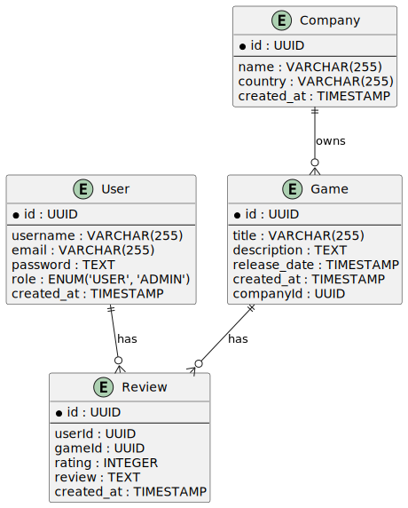
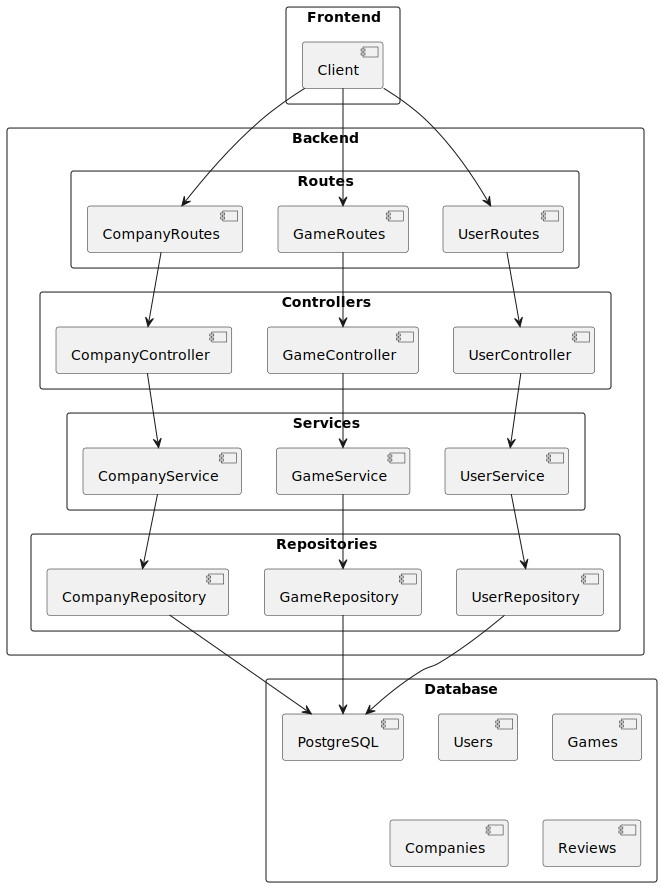

# Player Review

## Descrição

O **Player Review** é um sistema de avaliação de jogos que permite aos usuários atribuir notas de 0 a 5 estrelas, escrever resenhas e visualizar o ranking dos melhores jogos. Administradores podem gerenciar jogos e moderar avaliações.

## Tecnologias Utilizadas

- **Backend**: TypeScript, Express, PostgreSQL
- **Frontend**: React
- **API Documentation**: Swagger

## Funcionalidades

- Avaliação de jogos com notas e resenhas
- Edição e remoção de avaliações pelo próprio usuário
- Cadastro e gerenciamento de jogos
- Cadastro e gerencimento de empresas de jogos
- Ranking dos melhores jogos
- Ranking das melhores empresas

## Modelagem de Dados

O sistema utiliza um banco de dados PostgreSQL estruturado da seguinte forma:

### 🎮 **Tabela: Jogos (`games`)**

| Campo          | Tipo         | Descrição                     |
| -------------- | ------------ | ----------------------------- |
| `id`           | UUID (PK)    | Identificador único do jogo   |
| `title`        | VARCHAR(255) | Nome do jogo                  |
| `description`  | TEXT         | Descrição do jogo             |
| `company_id`   | UUID (FK)    | Empresa responsável pelo jogo |
| `release_date` | DATE         | Data de lançamento            |
| `created_at`   | TIMESTAMP    | Data de criação do registro   |

### 🏢 **Tabela: Empresas (`companies`)**

| Campo        | Tipo         | Descrição                        |
| ------------ | ------------ | -------------------------------- |
| `id`         | UUID (PK)    | Identificador único              |
| `name`       | VARCHAR(255) | Nome da desenvolvedora           |
| `country`    | VARCHAR(255) | País de origem da desenvolvedora |
| `created_at` | TIMESTAMP    | Data de criação do registro      |

### ⭐ **Tabela: Avaliações (`reviews`)**

| Campo        | Tipo          | Descrição                        |
| ------------ | ------------- | -------------------------------- |
| `id`         | UUID (PK)     | Identificador único da avaliação |
| `user_id`    | UUID (FK)     | Usuário que fez a avaliação      |
| `game_id`    | UUID (FK)     | Jogo avaliado                    |
| `rating`     | INTEGER (0-5) | Nota atribuída ao jogo           |
| `review`     | TEXT          | Texto da resenha                 |
| `created_at` | TIMESTAMP     | Data da avaliação                |

### 👤 **Tabela: Usuários (`users`)**

| Campo        | Tipo         | Descrição                      |
| ------------ | ------------ | ------------------------------ |
| `id`         | UUID (PK)    | Identificador único do usuário |
| `username`   | VARCHAR(255) | Nome de usuário                |
| `email`      | VARCHAR(255) | E-mail do usuário              |
| `password`   | TEXT         | Senha criptografada            |
| `role`       | ENUM         | Permissão (`user` ou `admin`)  |
| `created_at` | TIMESTAMP    | Data de criação do registro    |

### Diagrama de Entidade-Relacionamento



### Diagrama de Arquitetura



### Clonando o Repositório

```sh
git clone https://github.com/seu-usuario/player-review.git
cd player-review
```

### Executando o Projeto

Para iniciar o projeto, utilize o comando abaixo:

```sh
make run
```

## Contribuição

Sinta-se à vontade para contribuir com melhorias e novas funcionalidades. Para isso:

1. Faça um fork do repositório
2. Crie uma branch (`git checkout -b minha-feature`)
3. Faça commit das suas alterações (`git commit -m 'Adicionando nova feature'`)
4. Faça um push para a branch (`git push origin minha-feature`)
5. Abra um Pull Request

## Contribuidores

| [<br><sub>Paulo Victor</sub>](https://github.com/paulonc) | [<br><sub>Alfredo Andrade</sub>](https://github.com/AlfredoAndrade14) |
| ----------------------------------------------------------------------------------------------------------------------------------- | ----------------------------------------------------------------------------------------------------------------------------------------------- |
